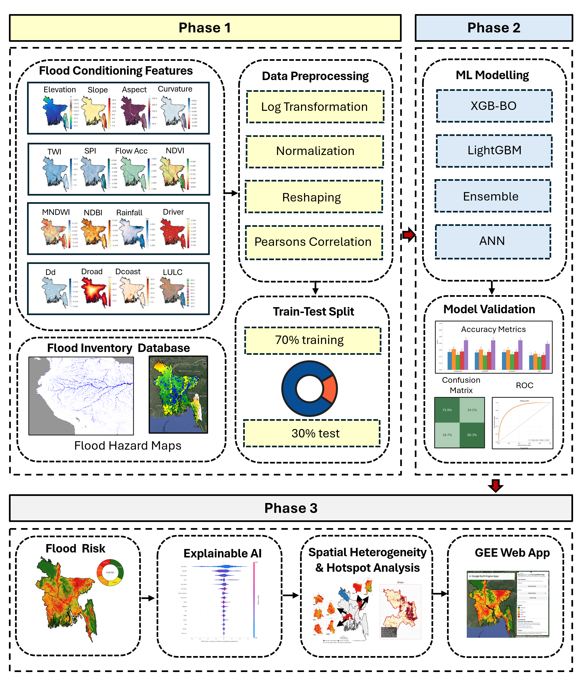
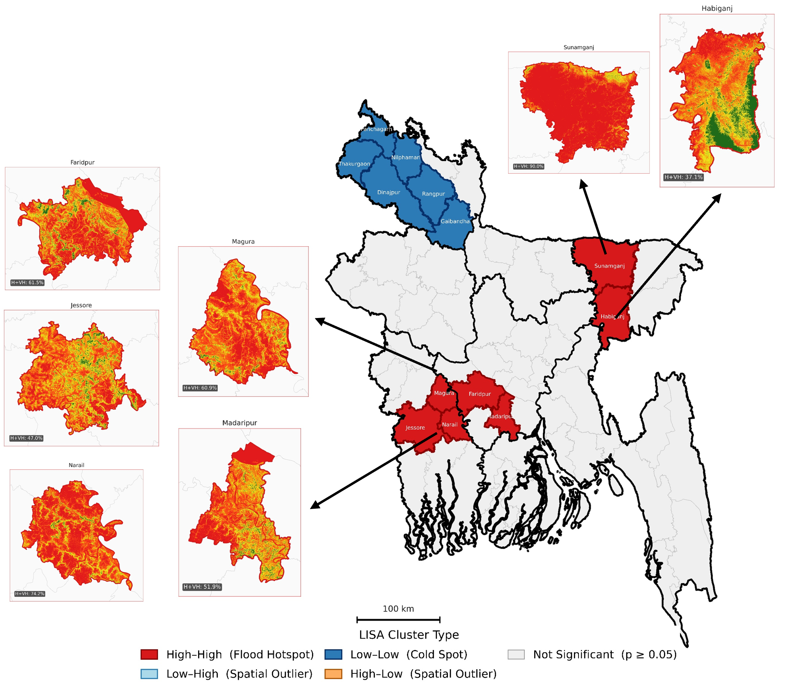
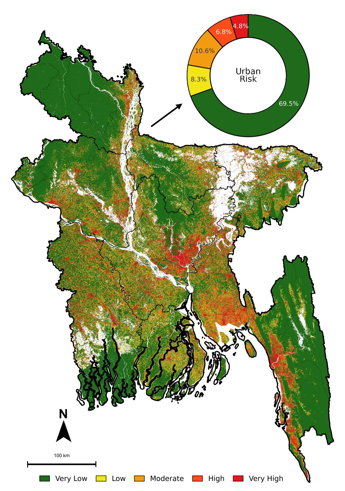

# Geospatial Artificial Intelligence-based Flood Susceptibility Mapping and Urban Flood Risk Assessment in Bangladesh

<p align="left">
  <a href="https://tinyurl.com/GeoAIFloodBD">
    
  </a>
  <a href="./LICENSE">
    
  </a>
  
  
  
</p>

A national-scale GeoAI framework for 30 m flood susceptibility mapping and pixel-level urban flood risk assessment in Bangladesh using machine learning, explainable AI, and spatial hotspot analysis.

---

## Live Application

**Launch the interactive Google Earth Engine app:**  
## [Open BD GeoAI Flood App](https://tinyurl.com/GeoAIFloodBD)

---

## Visual Highlights

<table>
  <tr>
    <td align="center" width="50%">
      
      <br>
      <b>Methodological Framework</b>
    </td>
    <td align="center" width="50%">
      
      <br>
      <b>Comparative ML Flood Susceptibility Maps</b>
    </td>
  </tr>
  <tr>
    <td align="center" width="50%">
      
      <br>
      <b>Spatial Clustering and Hotspot Analysis</b>
    </td>
    <td align="center" width="50%">
      
      <br>
      <b>National Pixel-Based Urban Flood Risk</b>
    </td>
  </tr>
</table>

---

## Overview

This repository accompanies the study **“Geospatial Artificial Intelligence-based Flood Susceptibility Mapping and Urban Flood Risk Assessment: A Machine Learning Framework to Reduce Flood Risk.”** It presents a reproducible national-scale workflow for:

- flood susceptibility mapping across Bangladesh,
- machine learning model comparison,
- explainable AI-based interpretation,
- pixel-level urban flood risk proxy generation, and
- district-level spatial clustering and hotspot detection.

The framework was developed to move beyond hazard-only mapping by identifying where modeled flood susceptibility co-occurs with dense built environments and concentrated population.

---

## Key Features

- **30 m national flood susceptibility mapping**
- **Four machine learning models:** XGBoost-BO, LightGBM, Stacking Ensemble, ANN
- **Explainable AI using SHAP**
- **Urban Flood Risk Proxy (UFRP)** integrating hazard, building exposure, and population concentration
- **District-level Moran’s I, LISA, and Getis-Ord Gi\*** analysis
- **Interactive Google Earth Engine deployment**

---

## Study Area

The study covers the full national territory of **Bangladesh**, including all **64 districts** across **8 divisions**, within one of the world’s most hydrologically complex deltaic environments.

---

## Data Sources

The modelling framework integrates multiple public geospatial datasets, including:

- **FABDEM** for terrain and hydrologic derivatives
- **CHIRPS v2.0** for rainfall
- **HydroSHEDS** for river proximity and drainage density
- **Landsat-8 OLI** for NDVI, MNDWI, and NDBI
- **ESA WorldCover 2021** for LULC
- **OpenStreetMap / HDX** for road distance
- **WRI Aqueduct v2** for flood inventory generation
- **TEMPO 2023 Q4** for building density, height, and volume proxy
- **WorldPop 2020** for gridded population concentration

---

## Flood Inventory

A binary flood inventory was derived using the **WRI Aqueduct historical river-flood inundation depth map** with a **0.1 m threshold**. The training dataset included:

- **10,000 flood points**
- **10,000 non-flood points**
- **20,000 total stratified samples**

---

## Models Evaluated

The following models were developed and compared:

- **XGBoost with Bayesian Optimization (XGB-BO)**
- **LightGBM**
- **Stacking Ensemble**
- **Artificial Neural Network (ANN)**

All models used a **stratified 70:30 train-test split** and **10-fold cross-validation**.

---

## Best Model

**XGBoost-BO** was selected as the reference model for the final flood susceptibility and urban flood risk analyses.

**Performance:**
- **AUROC:** 0.873
- **Accuracy:** 78.4%
- **Sensitivity:** 0.806
- **Specificity:** 0.763
- **F1-score:** 0.788

SHAP analysis identified **elevation**, **rainfall**, and **distance to coast** as the most influential predictors.

---

## Key Results

### Flood Susceptibility
- High and Very High susceptibility zones are concentrated in the **northeastern haor basin**, **north-central floodplain corridor**, **southwestern deltaic plain**, and **lower Meghna estuary**.
- Combined **High + Very High** susceptibility classes cover approximately **30%** of Bangladesh.
- **Sunamganj** was identified as the most flood-susceptible district.

### Urban Flood Risk
- The pixel-based urban flood risk proxy was computed for more than **130 million valid pixels**.
- **Very High** urban flood risk accounts for **4.77%** of valid pixels.
- Combined **High + Very High** urban flood risk accounts for **11.62%** of valid pixels.
- **Narayanganj** ranked as the highest urban flood risk district.

### Spatial Clustering
- Flood susceptibility exhibited significant positive spatial autocorrelation.
- Urban flood risk showed stronger clustering than susceptibility.
- A compact **central-eastern urban flood risk hotspot corridor** emerged along the Dhaka-Meghna system.

---

## Repository Structure

```text
BD-GeoAI-Flood/
├── README.md
├── LICENSE
├── BD_Fig2_Methodology.png
├── BD_Fig.6_GeoAI_ML_ModelsAll.png
├── BD_Fig.8_LISA_Hotspot_MoransI.png
└── BD_Fig.9_NationalPixelBasedUrbanFloodRisk.png
